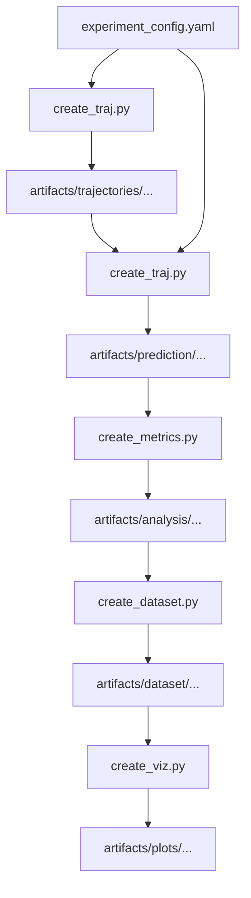

# Source Code

This directory and its subdirectories contain all the code required to execute the experimental pipeline. Each subdirectory contains a `README.md` explaining the module dependencies and data flows.

## Data Flow Across Steps

The plot below shows the data flow across the steps contained in the subdirectories. Note that `experiment_config.yaml` is located in the root directory.

