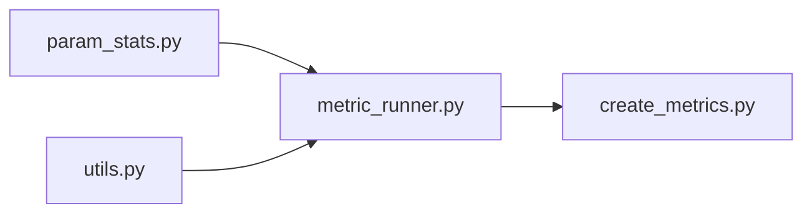
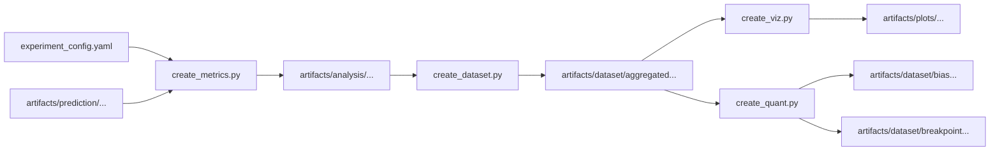

# Analysis Step

This directory handles the data analysis step.

## Module Dependency

The plot below shows the dependencies between the modules in this directory.

`create_viz.py` and `create_quant.py` are standalone modules that do not import any other functions from this codebase.

## Data Flow

The plot below shows the flow of data between files in this directory. Note that `experiment_config.yaml` is located in the root directory.

