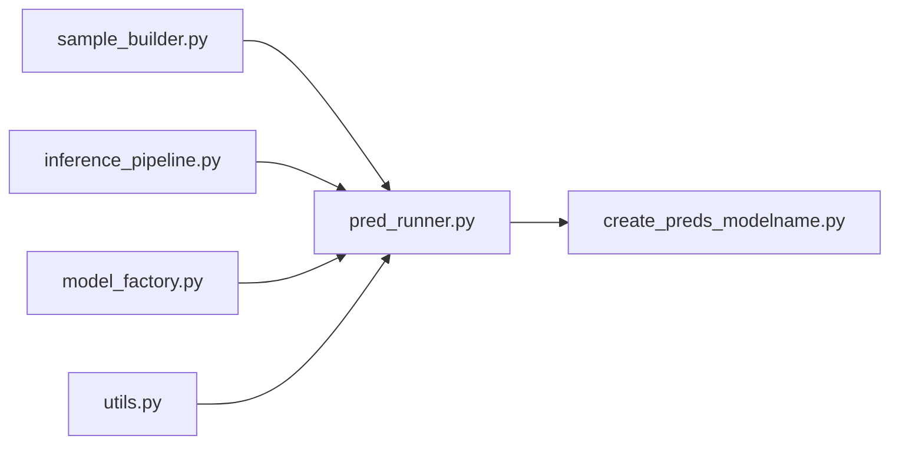
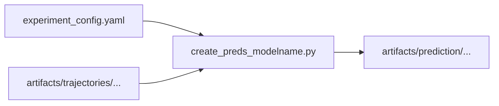

# Prediction Step

This directory handles the prediction step for each Time Series Foundation Model.

## Module Dependency

The plot below shows the dependencies between the modules in this directory.

## Data Flow

The plot below shows the flow of data between files in this directory. Note that `experiment_config.yaml` is located in the root directory.

